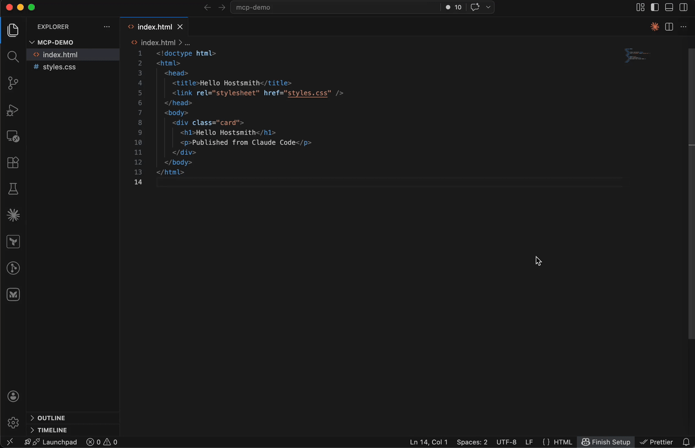

# @hostsmith/mcp-server

[](https://github.com/hostsmith/mcp-server/actions/workflows/ci.yml)
[](https://github.com/hostsmith/mcp-server/releases/latest)
[](./package.json)
[](./LICENSE)
[](https://modelcontextprotocol.io)
[](https://smithery.ai/servers/hostsmith/mcp-server)

Official [Model Context Protocol](https://modelcontextprotocol.io) server for the [Hostsmith](https://hostsmith.net) hosting platform.

**Static hosting for agents - give it a file, get a live URL.** Claude Code shipping an HTML report. Cursor previewing a generated demo. Claude Desktop publishing a one-pager. One MCP call → public HTTPS URL in seconds. No repo, no CI, no build step. Custom domains, private sites, EU or US data residency.



### Why Hostsmith

- **Artifact-first.** No repo, no build config - drop a file (or have the agent generate one), get a URL.
- **Built for agents.** MCP-native, OAuth-scoped, structured tool descriptions agents can chain.
- **EU or US data residency.** Pick where the user's data lives, architecturally - not via a checkbox.

## Tools

| Tool                   | Description                                                  |
| ---------------------- | ------------------------------------------------------------ |
| `list_sites`           | List all sites in your account for a given data partition    |
| `get_site`             | Get details of a specific site                               |
| `create_site`          | Create a new site                                            |
| `delete_site`          | Delete a site                                                |
| `list_domains`         | List available domains (shared and custom)                   |
| `get_account`          | Get account info, subscription plan, and usage               |
| `deploy_files`         | Deploy inline file contents to a site                        |
| `deploy_create_upload` | Start a direct upload for binaries / large files             |
| `deploy_finalize`      | Commit a deploy started with `deploy_create_upload`          |

## Usage

Authentication is via OAuth 2.0. Static access tokens are not supported.

### Claude Desktop

Open **Settings → Connectors → Add custom connector** and enter:

```
https://mcp.hostsmith.net/mcp
```

Claude Desktop runs the OAuth flow in your browser to authorize the connector against your Hostsmith account.

### Stdio (Claude Code, Cursor, Cline, Windsurf, Zed)

Add this entry to your MCP client's config:

```json
{
  "mcpServers": {
    "hostsmith": {
      "command": "npx",
      "args": ["-y", "@hostsmith/mcp-server"]
    }
  }
}
```

The first tool call triggers an OAuth flow in your browser to authorize the server against your Hostsmith account.

### Remote URL (other clients)

Any MCP client that supports remote Streamable HTTP transport can point directly at the hosted server:

```json
{
  "mcpServers": {
    "hostsmith": {
      "url": "https://mcp.hostsmith.net/mcp"
    }
  }
}
```

The client handles the OAuth flow automatically - you'll be redirected to Hostsmith to authorize access.

### Cursor (one-click install)

[](https://cursor.com/en/install-mcp?name=Hostsmith&config=eyJ1cmwiOiJodHRwczovL21jcC5ob3N0c21pdGgubmV0L21jcCJ9)

Click the badge to add the remote Hostsmith server (`https://mcp.hostsmith.net/mcp`) to Cursor. The first tool call triggers OAuth in your browser.

### Local HTTP (self-hosted)

Run the server in HTTP mode and have your MCP client perform OAuth against it:

```bash
npx @hostsmith/mcp-server http
```

```json
{
  "mcpServers": {
    "hostsmith": {
      "url": "http://localhost:3100/mcp"
    }
  }
}
```

## Environment variables

| Variable               | Default                  | Description                                                                                                                                                                                                                                                                                                                       |
| ---------------------- | ------------------------ | --------------------------------------------------------------------------------------------------------------------------------------------------------------------------------------------------------------------------------------------------------------------------------------------------------------------------------- |
| `HOSTSMITH_URL`        | `https://hostsmith.net`  | Hostsmith app URL (OAuth endpoints).                                                                                                                                                                                                                                                                                              |
| `HOSTSMITH_API_DOMAIN` | -                        | Override the upstream API domain across both partitions. The server prepends `us.api.` and `eu.api.` to the value you set. Example: `HOSTSMITH_API_DOMAIN=staging.example.com` routes calls to `https://us.api.staging.example.com` and `https://eu.api.staging.example.com`. Use this to point at a staging or proxied API host. |
| `HOSTSMITH_BASE_URL`   | -                        | Override the API base URL with a single fixed value, bypassing partition selection entirely.                                                                                                                                                                                                                                      |
| `PORT`                 | `3100`                   | HTTP server port.                                                                                                                                                                                                                                                                                                                 |
| `MCP_BASE_URL`         | `http://localhost:$PORT` | Public URL of the MCP server, used in OAuth metadata.                                                                                                                                                                                                                                                                             |

## Network access

The MCP transport and OAuth flow run in your client's app process and need no agent-sandbox configuration - if your MCP client connected, those paths are working.

The one place sandboxed agents commonly fail is the **upload PUT** during `deploy_create_upload` + `deploy_finalize`: the bytes go from the agent's shell to the partition API host. From the agent terminal, allow outbound HTTPS (port 443) to:

- `us.api.hostsmith.net` (for sites in the `us` partition)
- `eu.api.hostsmith.net` (for sites in the `eu` partition)

Sandbox-specific snippets (Cursor `sandbox.json`, Claude Code `settings.json`, Codex `config.toml`, generic firewall guidance) live in the [Network access](https://hostsmith.net/docs/mcp/network-access) docs.

## Troubleshooting

- **Tool calls return 401**: the OAuth session expired. Reconnect from your MCP client to re-authorize.
- **OAuth redirect loops**: confirm `MCP_BASE_URL` matches the URL your MCP client uses to reach the server.
- **Wrong partition**: tool calls accept an explicit `partition` arg; if you omit it, the partition is inferred from your access token.
- **Upload PUT fails (DNS, refused, proxy, timeout)**: the agent's shell can't reach the partition API host. See [Network access](https://hostsmith.net/docs/mcp/network-access).
- **Inspect the install**: `npx @modelcontextprotocol/inspector npx -y @hostsmith/mcp-server http` to browse tools interactively.

## Documentation

Deeper material lives at [hostsmith.net/docs/mcp](https://hostsmith.net/docs/mcp).

## Contributing

See [CONTRIBUTING.md](./CONTRIBUTING.md) (including the [Releases](./CONTRIBUTING.md#releases) section for the version-stamping flow). Security issues: see [SECURITY.md](./SECURITY.md).

## License

[MIT](./LICENSE)
